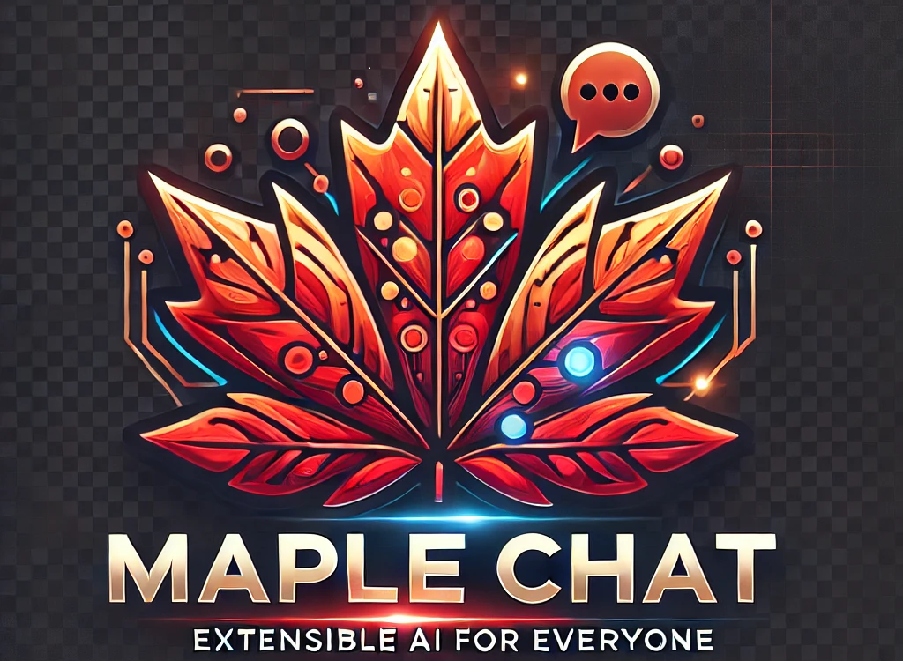

Live Demo Link: https://selmandemiray.github.io/Maple_Chat/  *(Back End Not Deployed)*
# Open Source AI Chat 🤖

A powerful, extensible, and easy-to-deploy platform for AI-driven conversations and multimodal interactions. This platform supports various AI models for text, image, audio, and code generation, designed with customization and scalability in mind.

<a href="#disclaimer">
  <button style="
    background-color: #ff4d4d;
    color: white;
    padding: 12px 24px;
    border: none;
    border-radius: 20px; 
    cursor: pointer;
    font-weight: bold;
    font-size: 16px;
    box-shadow: 0px 4px 8px rgba(0, 0, 0, 0.3);
    transition: transform 0.2s ease, box-shadow 0.2s ease; 
    ">
    ⚠️ Disclaimer ⚠️
  </button>
</a>


## ✨ Key Features

### 🌟 Multimodal AI Model Support
- **Text Generation**: GPT-style models (GPT-3, Vicuna)
- **Image Generation**: Stable Diffusion, DALL·E
- **Audio Processing**: Speech-to-text, text-to-speech capabilities
- **Code Generation**: Codex for programming assistance
- Flexible model switching based on specific tasks

### 🌐 Web Search Integration
- Real-time web search enrichment using DuckDuckGo API
- Enhanced context-rich responses
- Configurable search functionality

### ⚡ Performance
- Full GPU acceleration with NVIDIA CUDA support
- Optimized for Apple MPS (Metal Performance Shaders) on macOS
- Automatic CPU fallback when GPU is unavailable

### 🔧 Advanced Features
- **Dynamic Model Management**: Runtime model switching without container rebuilds
- **API Security**: Robust authentication with API keys and customizable rate limits
- **Health Monitoring**: Automatic checks for frontend and backend services


## 🚀 Getting Started

### Prerequisites

- [Docker](https://docs.docker.com/get-docker/)
- [Docker Compose](https://docs.docker.com/compose/install/)
- [NVIDIA Drivers](https://www.nvidia.com/Download/index.aspx) (for GPU support)

### Installation Steps

1. **Clone the Repository**
   ```bash
   git clone https://github.com/yourusername/open-source-ai-chat.git
   cd open-source-ai-chat
   ```

2. **Launch the Application**
   ```bash
   docker-compose up --build
   ```

## 🔌 API Reference

### Chat Endpoint
```bash
POST /chat

# Example Request
curl -X POST "http://localhost:8007/chat" \
  -H "Content-Type: application/json" \
  -d '{"user_input": "What is AI?", "model": "gpt-3.5-turbo"}'

# Example Response
{
  "response": "AI stands for Artificial Intelligence, a branch of computer science..."
}
```

### Health Check
```bash
GET /health

# Example Response
{
  "status": "healthy"
}
```

## 🐳 Docker Compose Configuration

```yaml
# docker-compose.yml
services:
  backend:
    build:
      context: .
      dockerfile: Dockerfile
    environment:
      - API_KEY=${API_KEY}
      - API_KEYS=${API_KEYS}
      - SECRET_KEY=${SECRET_KEY}
      - MODEL_NAME=${MODEL_NAME}
      - MAX_TOKENS=${MAX_TOKENS}
      - HOST=${HOST}
      - PORT=${PORT}
    env_file:
      - .env
    ports:
      - "8007:8007"
    volumes:
      - huggingface_cache:/home/myuser/.cache/huggingface
    deploy:
      resources:
        reservations:
          devices:
            - driver: nvidia
              count: 1
              capabilities: [gpu]
    healthcheck:
      test: ["CMD", "curl", "-f", "http://localhost:8007/health"]
      interval: 30s
      timeout: 10s
      retries: 3
      start_period: 40s

  frontend:
    image: nginx:alpine
    volumes:
      - ./index.html:/usr/share/nginx/html/index.html
      - ./logo.png:/usr/share/nginx/html/logo.png
      - ./nginx.conf:/etc/nginx/nginx.conf
    ports:
      - "8080:80"
    depends_on:
      - backend
    healthcheck:
      test: ["CMD", "wget", "-q", "-O", "-", "http://localhost:80/"]
      interval: 30s
      timeout: 10s
      retries: 3

volumes:
  huggingface_cache:
    driver: local
```

## 🛡️ DevSecOps

This project prioritizes security and uses the following tools:

* **Snyk**:  Snyk helps find and fix vulnerabilities in your code, open source dependencies, containers, and infrastructure as code.
    * To set up Snyk, you'll need to create a Snyk account and connect it to your GitHub repository.  Snyk will then automatically scan your code for vulnerabilities and provide recommendations for remediation. For more information, see the [Snyk documentation](https://docs.snyk.io/).
* **SonarCloud**: SonarCloud is a cloud-based code analysis service that helps you improve code quality and security by identifying bugs, vulnerabilities, and code smells.
    * To integrate SonarCloud, you'll need to create a SonarCloud account and add your project. You'll also need to configure your CI/CD pipeline to run SonarCloud analysis on each code change.  See the [SonarCloud documentation](https://sonarcloud.io/documentation/) for details.

## 🤝 Contributing

We welcome contributions! Here's how you can help:

1. Fork the repository
2. Create your feature branch (`git checkout -b feature/AmazingFeature`)
3. Commit your changes (`git commit -m 'Add some AmazingFeature'`)
4. Push to the branch (`git push origin feature/AmazingFeature`)
5. Open a Pull Request

## 📚 Technologies Used

- [FastAPI](https://fastapi.tiangolo.com/): Web framework
- [HuggingFace Transformers](https://huggingface.co/): AI models
- [Nginx](https://nginx.org/): Web server
- [Docker](https://www.docker.com/): Containerization
- [DuckDuckGo API](https://duckduckgo.com/): Web search integration

## 📝 License

MIT License - See [LICENSE](LICENSE) for details.


## ⚠️ Disclaimer <a name="disclaimer"></a>

This project is provided "as is" without any warranty whatsoever, express or implied, including but not limited to the implied warranties of merchantability, fitness for a particular purpose, and non-infringement.   
 In no event shall the authors or copyright holders be liable for any claim, damages, or other liability, whether in an action of contract, tort, or otherwise, arising from, out of, or in connection with the software or the use or other dealings in the software.   


Users are solely responsible for ensuring their use of this software complies with all applicable laws and regulations, including but not limited to data protection, privacy, and intellectual property laws. This includes, but is not limited to, responsibility for any content generated or disseminated through the use of this software, regardless of whether such content is generated by the user directly or by any AI model utilized by the software. 

**Ethical and Responsible Use:**

This software is intended for ethical and safe purposes only.  It is crucial that users utilize this software responsibly and with due consideration for the potential impact of AI-generated content. Users must adhere to the following principles:

* **Respect for Human Dignity and Rights:**  The software should not be used to generate or disseminate content that promotes discrimination, hatred, violence, or exploitation, or that infringes upon the fundamental rights and freedoms of individuals or groups.
* **Accuracy and Truthfulness:** Users must strive to ensure the accuracy and truthfulness of any information generated or disseminated through the software. The software should not be used to create or spread disinformation, misinformation, or propaganda.
* **Privacy and Data Security:** Users must respect the privacy of others and comply with all applicable data protection laws and regulations. The software should not be used to collect, store, or process personal data without proper consent and security measures.
* **Accountability and Transparency:** Users should be transparent about the use of AI in the creation of any content and take responsibility for the outputs generated by the software.
* **Safety and Security:** The software should not be used to generate or disseminate content that could endanger individuals or public safety, or to engage in any malicious or harmful activities.
* **Environmental Responsibility:** Users should be mindful of the environmental impact of AI and strive to use the software in an energy-efficient manner.

**Prohibited Uses:**

The following uses of the software are strictly prohibited:

* Generating or disseminating harmful, illegal, defamatory, misleading, or false information, including disinformation, misinformation, and propaganda.
* Generating inappropriate, offensive, sexually explicit, violent, hateful, or exploitative images, videos, or text prompts.
* Infringing upon the rights of others, including copyright, trademark, privacy, or publicity rights.
* Impersonating any person or entity, or falsely stating or otherwise misrepresenting your affiliation with a person or entity.   

* Using the software for illegal activities, to circumvent security measures, or to interfere with the operation of the software or any related systems.
* Generating or disseminating spam or unsolicited commercial communications.
* Using the software in a manner that could damage, disable, overburden, or impair the software or any related systems.
* Attempting to gain unauthorized access to the software, other users' accounts, or any related systems.
* Reverse engineering, decompiling, or disassembling the software.
* Using the software to design, develop, or manufacture weapons, or to contribute to any activity that violates international law or poses a threat to national security. 
* Using the software to generate content that could be used to facilitate illegal activities, such as fraud, theft, or terrorism.
* **Using the software to manipulate or deceive others, including creating deepfakes or synthetic media with the intent to mislead.**
* **Using the software to generate or promote content that encourages or facilitates self-harm or suicide.**
* **Using the software to engage in or promote any form of cyberbullying or online harassment.**
* **Using the software commercially without explicit permission from the copyright holders.**

**Jurisdiction and Governing Law:** While users are subject to the laws of their respective jurisdictions, Canadian law will always be used to interpret and assess any matters related to AI usage and regulations. This includes, but is not limited to, data privacy, intellectual property, and content generation. By using this software, users acknowledge and agree to these terms and conditions. 
